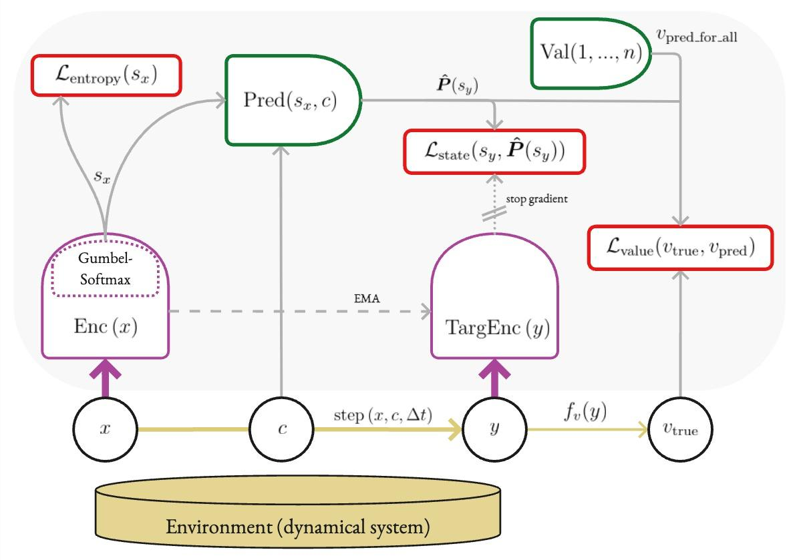
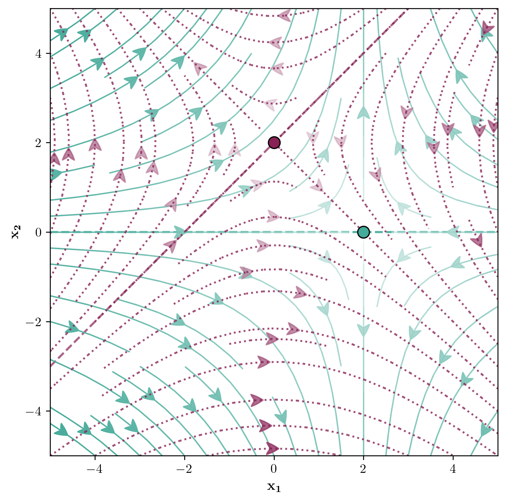
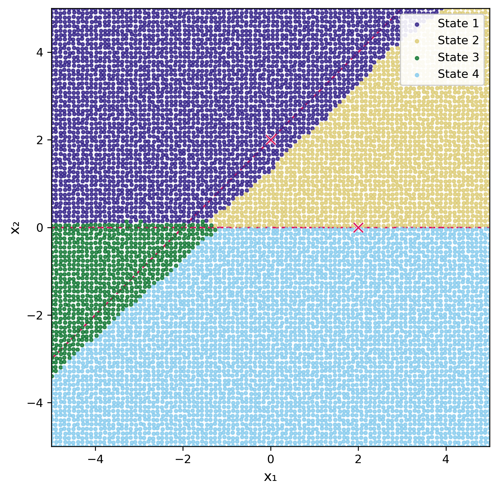
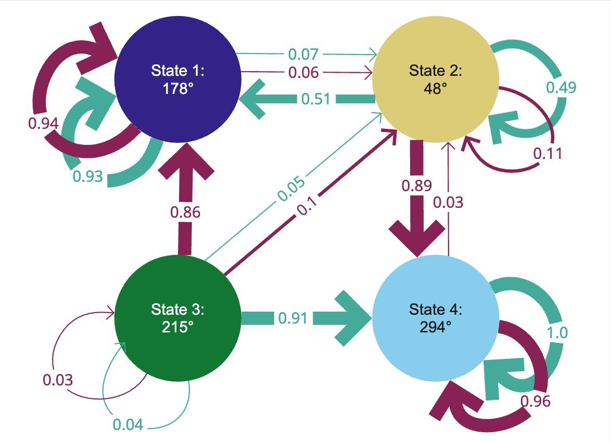

# Learning Discrete MDPs from Dynamical Systems

[](https://www.python.org/)
[](https://pytorch.org/)

A self-supervised neural network that learns finite, discrete Markov Decision Processes from continuous dynamical systems.



## Overview

Many real-world systems — climate tipping points, economic transitions, ecological
regime shifts — are described by continuous differential equations but reasoned about as discrete state machines. The **Discrete Representation Model (DRM)** bridges that gap automatically.

Given trajectories from a continuous dynamical system, the DRM simultaneously learns
a discrete state space (how to partition the continuous phase space into meaningful
regions) and action-dependent transition dynamics (probabilities of moving between
states under each control). Training is entirely self-supervised: the model receives
`(observation, control, next observation)` tuples and discovers MDP structure on its
own, with no state labels required.

This repository provides a complete end-to-end pipeline — from dynamical system
definition and ODE-based data generation through model training, hyperparameter
optimization, and visualization.

## Architecture

The DRM consists of four neural networks trained simultaneously:

- **Encoder** — maps continuous observations to discrete states via Gumbel-Softmax
  with temperature annealing, enabling gradient-based learning of discrete
  one-hot representations
- **Target encoder** — a stable copy of the encoder updated via exponential moving
  average (EMA), providing training targets without gradient interference
- **Predictor** — takes the current state and control as input and outputs a
  probability distribution over next states; this is the learned MDP transition function
- **Value network** — predicts a scalar value per state, preventing representation
  collapse via an auxiliary prediction task

Loss is computed in discrete representation space: KL divergence for state prediction,
MSE for value prediction, and entropy regularization to prevent state collapse.

## Results

The DRM was validated on the **Saddle System**, a family of 2D toy dynamical systems
with analytically defined ground truth state boundaries, enabling quantitative evaluation
via linear probing.

| | |
|---|---|
|  |  |

*Left: phase portrait showing two action-dependent flow fields. Right: discrete states
learned by the DRM — four coherent regions that closely match potential "ground truth" boundaries (dashed lines).*



*Exemplary visualization of a learned MDP. Nodes are discrete states; arrow color represents two different actions (saddles) and arrow thickness represents transition probability; node labels show predicted angular value for each state.
The learned MDP meaningfully represents the dynamics of the saddle system with attractor states 1 and 4 and unstable states 2 and 3.*

**Ablation study** — contribution of each architectural component:

| Removed component | Accuracy impact |
|---|---|
| Gumbel-Softmax | −19.8 pp |
| Entropy regularization | −10 pp |
| Value network | −3 pp |

Full model: **93–98% balanced state accuracy** across four Saddle System variants.

The DRM was also explored qualitatively on the Technology Substitution system and the
Social Tipping system.

## Repository Structure
```text
mdp-world-model/
├── data_generation/
│   ├── models/           # Dynamical system definitions (saddle, tech substitution, social tipping, FitzHugh-Nagumo)
│   ├── simulations/      # Grid-based sampler and ODE simulator
│   └── visualization/    # Phase portrait plotting
├── datasets/             # SQLite schema, data access, simulation runners
├── neural_networks/      # Core ML code
│   ├── drm.py            # Model architecture
│   ├── drm_loss.py       # Loss functions (KL divergence, entropy regularization)
│   ├── drm_dataset.py    # PyTorch datasets
│   ├── drm_viz.py        # Visualization
│   ├── train_drm.py      # Training script
│   └── system_registry.py  # Per-system configuration
├── notebooks/
│   └── saddle_explorer.py  # Interactive marimo notebook
└── scripts/
│   ├──configs/          # YAML configs (base, sweeps, ablation)
│   ├──parameter_sweep.py   # Bayesian HPO with Optuna + SQLite backend
│   └──post_sweep_analysis.py
```

## Getting Started

```bash
git clone https://github.com/Lighfe/mdp-world-model.git
cd mdp-world-model
conda env create -f environment.yml
conda activate mdp-world-model
```

Generate a dataset:

```bash
python datasets/run_saddle_simulation.py
```

Train the model:

```bash
python neural_networks/train_drm.py scripts/configs/base.yaml
```

## Project Context

Developed as a master's thesis at TU Berlin in cooperation with the Potsdam Institute
for Climate Impact Research (PIK), supervised by Naima Elosegui Borras,
Tom Neuhäuser, and Dr. Jobst Heitzig.